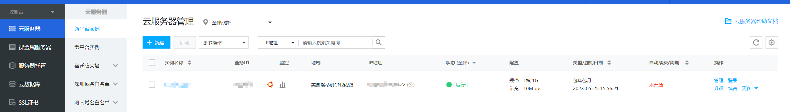
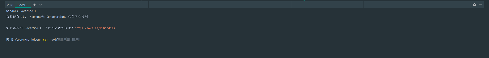
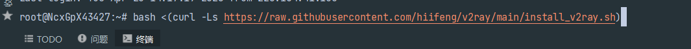
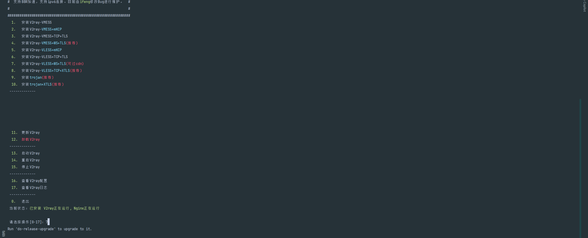
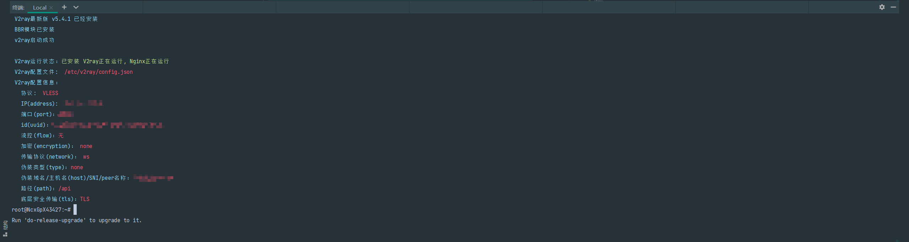
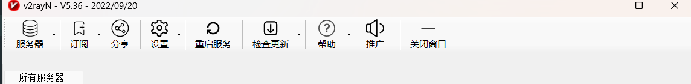
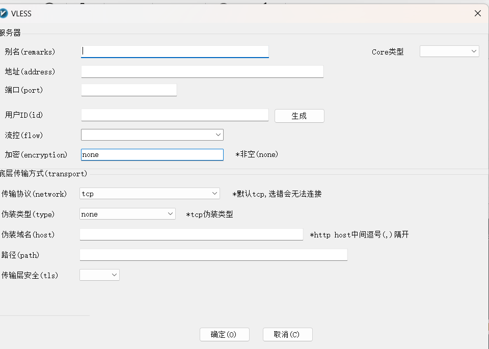

# 自己搭建一个vpn

## 前言
因为现在大部分的vpn都是收费的，而且收费的vpn也不一定能够保证安全，所以我想自己搭建一个vpn，
这样就能够保证安全，而且只需要一个外网服务器，和一个域名就够了

## 服务器
上面也说了需要一个外网的服务器，我使用的是尊云的服务器，相对来说只使用vpn这个还是足够便宜的
尊云地址`http://www.zun.com/`
选择自己需要的服务器进行购买，我建议是一个月一个月卖，以免ip被封，不会损失太多

搭配好自己的服务器，就可以开始下一步了

## 域名
域名就是阿里云的的域名，自己购买一个域名

## 开始搭建
第一步链接自己的服务器, 我使用的webstorm的终端，powerShell比较方便，也可以使用其他的终端

使用命令`ssh root@ip`链接服务器，输入密码就可以链接上了

第二步使用命令, 一键安装v2ray

`bash <(curl -Ls https://raw.githubusercontent.com/hiifeng/v2ray/main/install_v2ray.sh)`

第三部选择版本安装 

这里选择这个可过cdn

然后选择y进行下一步，伪装域名，这里就用到了自己的域名

下一步输入一个nginx端口，最好是大一点在 40000 以上的端口

然后就是伪装路径，可以写可以不写我写的是一个/api

选择伪装类型，可以随意选择，我选择的是小说网站

后面的步骤都是一路y就可以等待安装，后面会给你配置详情 ，记得复制保留，后面会用到

## 安装v2ray

 [v2ray下载](https://github.com/2dust/v2rayN/releases)

打开软件进行配置

点击这个先看一下上一步的配置信息里的协议，选择要添加的服务器

这边就一一对应上一步的配置信息，别名可以随便写，

然后就完成啦，是不是很简单，这样就可以自己搭建一个vpn啦，快去试试吧

